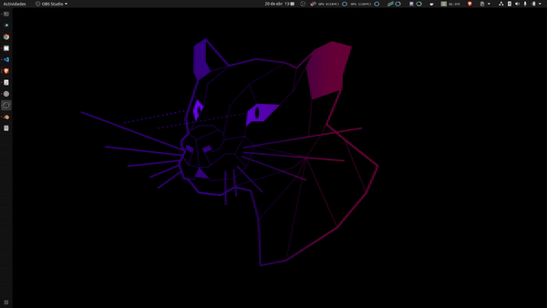

# GPU Monitor

Real-time NVIDIA GPU monitor for Linux. Split into a small backend daemon that reads NVML and exposes an HTTP/SSE API, plus a system-tray frontend that renders an icon and menu in the Ubuntu/GNOME panel.



## Architecture

```
+-------------------+       HTTP/SSE        +----------------------+
|   gpu-monitord    | <-------------------- |   gpu-monitor-tray   |
|  (NVML sampler)   |   /v1/stream JSON     |  (ksni + tiny-skia)  |
+-------------------+                       +----------------------+
        ^                                            ^
        | NVML                                       | DBus (StatusNotifierItem)
        v                                            v
   NVIDIA driver                              GNOME / KDE panel
```

Both binaries are written in Rust. They live in a single Cargo workspace under `crates/`:

- `gpu-monitor-core` — shared `Snapshot`/`Gpu`/`Process` types serialised with `serde`.
- `gpu-monitord` — backend daemon. Reads NVML once at boot, polls every second, serves cached snapshots over REST + Server-Sent Events. Defaults to `127.0.0.1:9123`.
- `gpu-monitor-tray` — Linux system-tray frontend. Subscribes to `/v1/stream`, renders a per-GPU icon (donut + temperature) with `tiny-skia`, exposes a per-GPU submenu via `ksni`.

The split is what allows another machine to consume the same metrics: a remote frontend (Mac, Windows, web) just hits the API. Only the local Linux frontend is implemented for now.

## Requirements

- NVIDIA driver with NVML (the `nvidia-smi` package). Tested with driver 555.42.06 / CUDA 12.5.
- DejaVu Sans Mono font (`apt install fonts-dejavu-core`).
- A desktop with StatusNotifierItem support. On Ubuntu/GNOME this means the **AppIndicator** extension (`gnome-shell-extension-appindicator`) must be enabled. KDE works out of the box.
- Rust toolchain (`stable`, ≥ 1.85). `rustup` will pick it up automatically from `rust-toolchain.toml`.

## Build

```bash
cargo build --release --workspace
```

Produces two binaries:

- `target/release/gpu-monitord`
- `target/release/gpu-monitor-tray`

## Run

In two terminals (or as services, see below):

```bash
./target/release/gpu-monitord --bind 127.0.0.1 --port 9123
./target/release/gpu-monitor-tray --backend-url http://127.0.0.1:9123
```

The daemon flags (`--bind`, `--port`, `--sample-interval-ms`, `--mock`) are documented in [`docs/api.md`](docs/api.md). The tray accepts `--backend-url` and `--icon-height`.

### Quick API smoke test

```bash
curl -s http://127.0.0.1:9123/v1/snapshot | jq
curl -N http://127.0.0.1:9123/v1/stream      # SSE: one event per second
```

## Install (optional)

Daemon as a `systemd --user` service:

```bash
install -Dm755 target/release/gpu-monitord ~/.local/bin/gpu-monitord
install -Dm644 packaging/systemd/gpu-monitord.service \
    ~/.config/systemd/user/gpu-monitord.service
systemctl --user daemon-reload
systemctl --user enable --now gpu-monitord
journalctl --user -u gpu-monitord -f
```

Tray as a session autostart:

```bash
install -Dm755 target/release/gpu-monitor-tray ~/.local/bin/gpu-monitor-tray
install -Dm644 assets/tarjeta-de-video.png \
    ~/.local/share/gpu-monitor/tarjeta-de-video.png
install -Dm644 packaging/autostart/gpu-monitor-tray.desktop \
    ~/.config/autostart/gpu-monitor-tray.desktop
```

## API

See [`docs/api.md`](docs/api.md) for the full schema and endpoint reference. Quick reference:

| Endpoint | Purpose |
|---|---|
| `GET /healthz` | liveness |
| `GET /v1/info` | backend / driver metadata |
| `GET /v1/snapshot` | full latest snapshot |
| `GET /v1/gpus` | per-GPU metadata only |
| `GET /v1/gpus/{idx}` | one GPU |
| `GET /v1/gpus/{idx}/processes` | process list |
| `GET /v1/stream` | SSE — one snapshot per event |

## Roadmap

- v2.0: Linux tray frontend (this release)
- v2.1: Auth token + LAN bind for remote consumption
- v2.2: macOS / Windows tray frontends consuming the same backend

## Legacy Python script

The original `gpu_monitor.py` is still in this directory and may be used during migration. It will be moved to a `legacy/` subdirectory and removed entirely once the Rust release is fully validated.

## Support

If this is useful to you, consider giving a **☆ Star** to the repository or buying a coffee:

[](https://www.buymeacoffee.com/maximofn)
